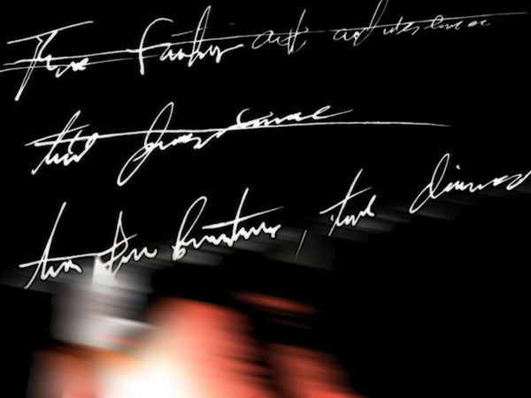
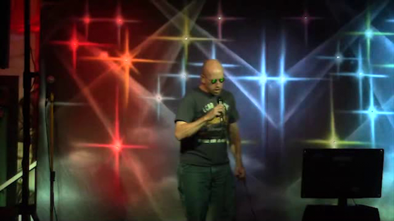
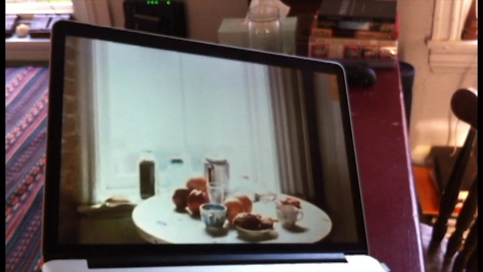
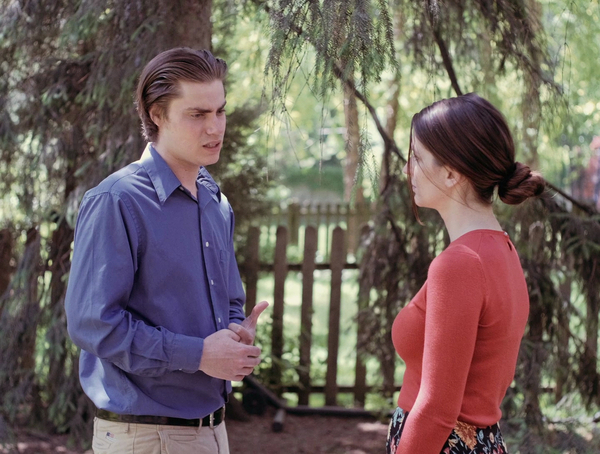
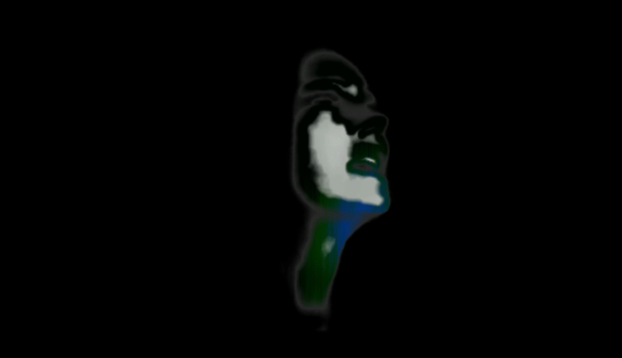
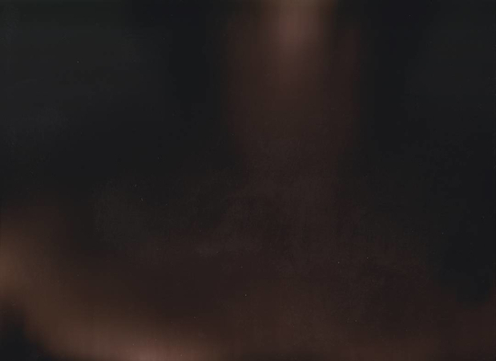

# videos
 

**a turn**  

<em> January 2021, TriQuarterly Magazine </em> 
A video-poem on time. 

  

**Only Want To See You** 

<em>December 2020, trailer screened at Vox Populi Holiday Minute-Fest</em> 
A 2hr2min compilation version of a [YouTube playlist](https://youtube.com/playlist?list=PL7M_1lZMWufLil1p9jGDPWy6wuO3JAN-F&si=eMj9lxp3W_HtZHw0) of white guys singing Purple Rain at karaoke.

[A 2min2sec trailer also exists.](https://youtu.be/p9IQbnYUi20?si=WYInDiWny-87fnCA)  

  

**Watching 'La Chambre'** 

<em> April 2020, unreleased</em> 
A quarantine tribute to Chantal Akerman.

Consolidated and made more efficient in its sequel, [Watching Watching La Chambre While Watching Watching La Chambre](https://youtu.be/Fy9UaUE_4ZU?si=UVC3lcC12OxCtfhm). 

  

**Awl My Suns**  

<em>May 2018, unreleased</em> 
A group of actors struggle with unnatural dialogue as a group of filmmakers struggle with the natural world.

This film began as an experiment in treating the rhyme and rhythm of a found text as a formal constraint for a stream-of-consciousness written piece. Because the source text consisted of a scene from a play, <em>All My Suns</em> by Arthur Miller, the new text was then staged and performed by a group of actors -- who, in turn, were directed to perform according to the intentions of the source text, in a sense pitting them against the new text. Complications arise, and the film becomes something else entirely. 

  

**Rain** 

<em>October 2017, Bottlecap Press</em> 
Using footage from a classic Gloria Swanson film, this video-poem explores memory, desire, and mortality. 

  

**BRIDE OF FRANKENSTEIN** 

<em>March 2016, screened at ERCATX 2016, Desert Daze Festival, Chicago Underground Film Festival, and others</em> 
Due to an agreement with the performers, this film is not available online. It depicts the comingling of bodies becoming light, and holds a special significance to me. Not recommended for the epileptic. 

